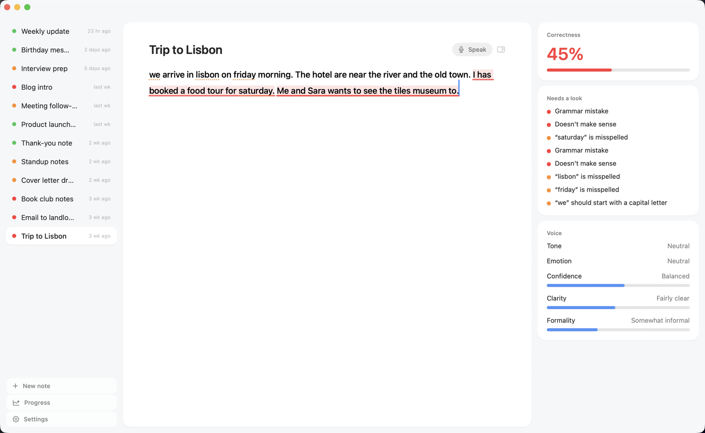
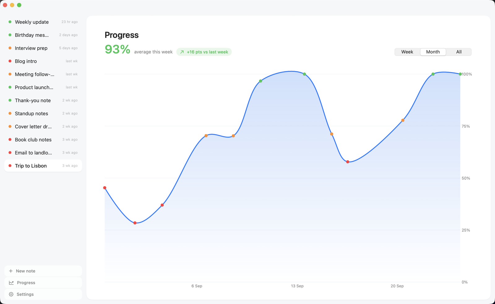
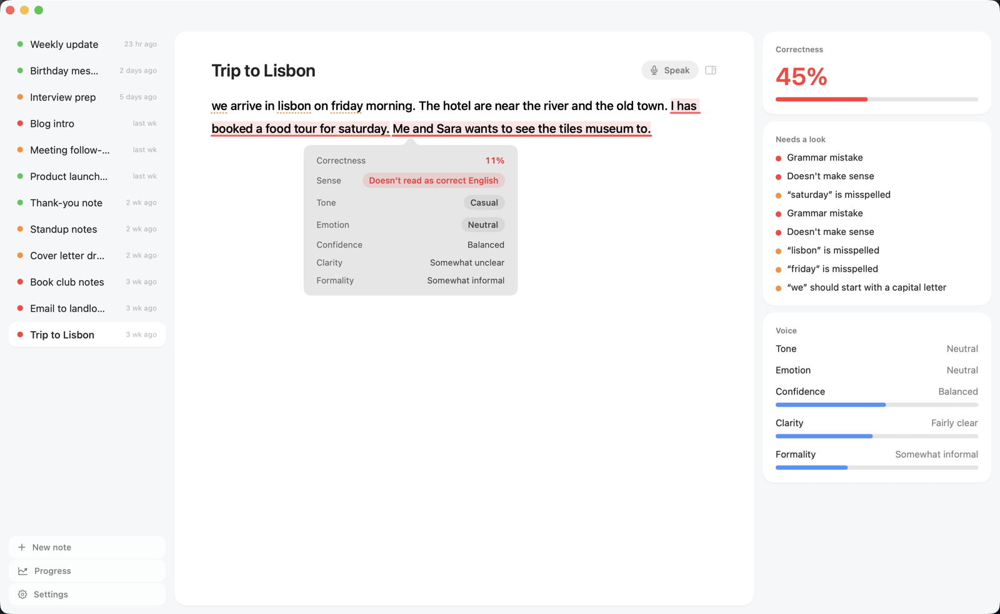

<p align="center">
  
</p>

<h1 align="center">Plumb</h1>

<p align="center"><b>Write better English, and watch yourself get better.</b><br>
A beautiful notes app for your Mac that checks your writing live, privately, with its own AI model.<br>
Free and open source, forever.</p>

<p align="center">
  <a href="https://github.com/nagavineerpasam/plumb/releases/latest/download/Plumb.dmg"><b>⬇&nbsp;&nbsp;Download Plumb for Mac</b></a><br>
  <sub>Apple Silicon (M1 or newer) · macOS 14 or newer · free</sub>
</p>

<p align="center">
  <picture>
    <source media="(prefers-color-scheme: dark)" srcset="docs/screenshots/dark-editor.png">
    
  </picture>
</p>

---

## Why Plumb

Most writing tools fix your text for you, so you never learn. Plumb does the opposite: it **shows** you what's off and leaves the fixing to you. Every note becomes practice, and the Progress chart shows you getting better week by week.

- **Live checks as you type.** Grammar mistakes, sentences that don't read as real English, spelling, capitals and punctuation, all marked the moment you pause.
- **A Correctness score for every note.** One number that tells you how clean your English is, with a short list of what needs a look.
- **Your writing voice.** See the tone, emotion, confidence, clarity and formality of what you write, so an email to your manager doesn't sound like a text to a friend.
- **Speak instead of type.** Click **Speak** and talk; your words land in the note and get checked like anything you type.
- **Progress you can see.** Every note is scored and charted, so you can see yourself improving.
- **Private by design.** The AI model runs on your Mac. No account, no cloud, no tracking. Your notes never leave your computer.

<p align="center">
  <picture>
    <source media="(prefers-color-scheme: dark)" srcset="docs/screenshots/dark-progress.png">
    
  </picture>
</p>

## What the marks mean

| Mark | Meaning | Example |
|---|---|---|
| Red underline | Likely a grammar mistake | "The results **is** ready." |
| Soft red highlight | Doesn't read as correct English | "…because of okay" |
| Amber dots | Spelling, capitals or punctuation | "wensday", "hello how are you" |

Hover any sentence for its Correctness and voice:

<p align="center">
  
</p>

## Install

1. **[Download Plumb.dmg](https://github.com/nagavineerpasam/plumb/releases/latest/download/Plumb.dmg)**, open it, and **drag Plumb onto Applications**.
2. **Open Plumb.** The first time, macOS stops it because it isn't from the App Store:
   - click **Done** on the warning,
   - open **System Settings → Privacy & Security**,
   - scroll down to *"Plumb" was blocked* and click **Open Anyway**, then **Open**.

   You only do this once. (Plumb isn't signed with a paid Apple developer certificate yet.)

On first launch Plumb downloads its writing model (about 800 MB) once, with a progress bar. After that it works completely offline.

**Requirements:** an Apple Silicon Mac (M1 or newer), macOS 14 or newer, and about 2.5 GB of free disk space. Speaking into notes currently needs macOS 26.

Your notes are plain Markdown files in `~/Library/Application Support/Plumb/Notes` (Settings → Show notes in Finder).

## Privacy

Everything runs on your Mac: the writing model, speech recognition, your notes. There are no accounts, no tracking and no servers. The only network access is the one-time model download.

## How it works

Plumb is built on [Laya](https://github.com/NandhaKishorM/laya), an open-source model that answers typed questions about text in a single pass instead of generating text. That makes it fast enough to run on a laptop CPU. Plumb fine-tunes Laya's English checkpoint to judge writing and asks it about what you write:

- does it contain a grammar mistake?
- does it make sense?
- what is its tone, emotion and formality?
- how confident and how clear is it?

Spelling, capitals and punctuation use the built-in macOS spell checker plus exact rules.

Accuracy of the shipped model, measured on text it never trained on:

| Signal | Test set | Accuracy |
|---|---|---|
| Grammar | CoLA (public) | 77.5% |
| Emotion | DAIR Emotion (public) | 90.6% |
| Sense, tone, formality, confidence, clarity | Hand-drafted English sets | 90–97% (optimistic: drafted like the training data) |

Real-world accuracy is lower than these numbers, especially for Sense. Plumb is a learning aid, not an authority.

## Build from source

```bash
git clone https://github.com/nagavineerpasam/plumb.git && cd plumb
python3.12 -m venv .venv && .venv/bin/pip install -e "engine[test]"   # the signal engine
cd app && swift run                                                   # the app (uses the venv above)
```

- **Release build:** `app/scripts/build-release.sh 0.1.0` builds `dist/Plumb.app` and `dist/Plumb.dmg` with Python and the engine inside.
- **Tests:** `swift test` in `app/`, and `pytest` in `engine/`.
- **Retraining:** the model is fine-tuned on Kaggle with `engine/notebooks/writing_signals_finetune_kaggle.ipynb`.

## Credits

- [Laya](https://github.com/NandhaKishorM/laya) by Nanda Kishor M (Apache-2.0).
- Trained with [CoLA](https://nyu-mll.github.io/CoLA/), [DAIR Emotion](https://huggingface.co/datasets/dair-ai/emotion) and [Pavlick formality scores](https://huggingface.co/datasets/osyvokon/pavlick-formality-scores) (CC BY 3.0), plus hand-drafted English sets in `engine/data`.

## License

- **Code:** Apache-2.0. See [LICENSE](LICENSE).
- **The writing model** (`plumb-model.zip` on the releases page) is free for **non-commercial use**. It was fine-tuned from Laya on data that includes research-and-education-only datasets (CoLA, DAIR Emotion) and sentences drafted with the help of an AI assistant. It's meant for personal learning, not for building paid products. If you fork Plumb to sell it, retrain the model on data you're licensed to use commercially.
